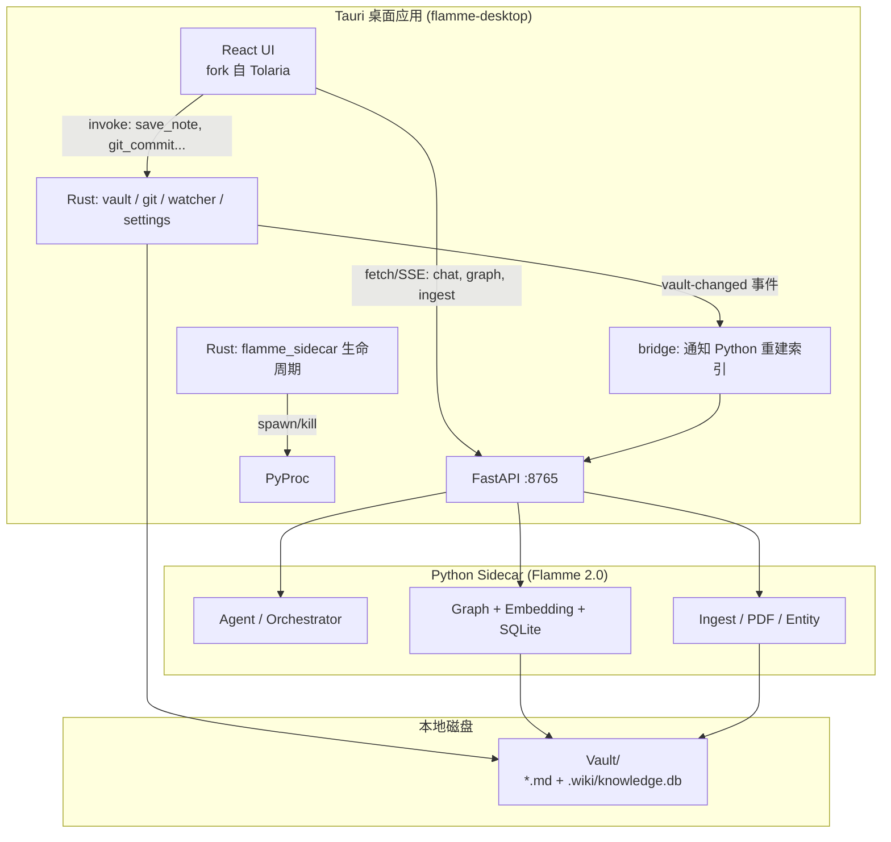
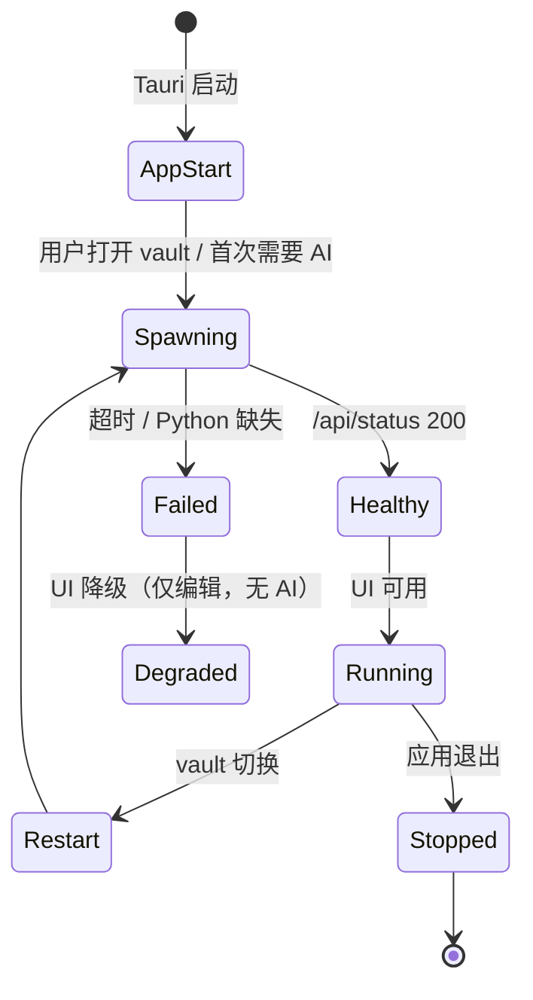
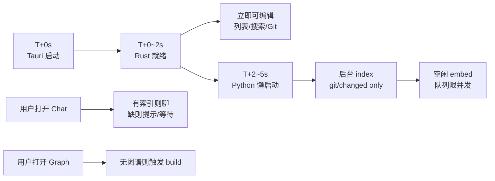

# Flamme × Tolaria 集成蓝图

> 知识库 IDE（3.0）架构设计 — Tolaria 壳 + Flamme 脑  
> 日期：2026-05-28  
> 关联仓库：`llm-wiki-2`（2.0 后端）、`tolaria-reference`（Tolaria 开源参考）、本仓库（3.0 产品）

---

## 1. 目标与原则

### 1.1 产品目标

构建 **「Cursor for Knowledge」** 式桌面 IDE：

- **编辑体验**：Bear 式四栏、BlockNote 富文本、wikilink、Git —— 来自 Tolaria
- **智能能力**：Agent 对话、语义检索、知识图谱、文档摄入 —— 来自 Flamme 2.0 Python 后端
- **数据主权**：笔记在本地 vault，LLM 只转发，不持久化用户内容

### 1.2 架构原则

| 原则 | 说明 |
|------|------|
| **不做微服务** | 本地 FastAPI 单体 + Tauri sidecar，非 K8s |
| **文件系统唯一真相源** | Markdown 读写走 Rust（Tolaria vault 层） |
| **AI 索引是派生层** | SQLite + 向量 + 图谱在 Python，可重建 |
| **Fork 不重写** | Tolaria 前端/Rust vault 直接 fork，只替换 AI 层 |
| **API 边界清晰** | Rust = 文件/Git/监听；Python = Agent/Graph/RAG/摄入 |
| **编辑不阻塞** | 打开 vault 立即可读写；Python 索引后台异步 |
| **智能按需加载** | 默认不全库 ingest；Graph/embed 按用户动作触发 |
| **全本地、不上云** | Python sidecar 只监听 `127.0.0.1`；笔记与索引不出本机 |

---

## 2. 总体架构



### 2.1 进程模型

| 进程 | 技术 | 端口/通道 | 职责 |
|------|------|-----------|------|
| **主进程** | Tauri + WebView | — | UI 渲染、Rust IPC |
| **Rust 运行时** | 同进程内 | `invoke` / `emit` | vault CRUD、Git、文件监听 |
| **Flamme sidecar** | Python uvicorn | `127.0.0.1:8765` | AI、图谱、摄入、索引 |
| ~~MCP ws-bridge~~ | Node（可选） | 9710/9711 | **Phase 3 再启用**，非 MVP |

### 2.2 Tolaria vs Flamme：后端形态对比（为何感觉「怪」）

| 维度 | Tolaria | Flamme 2.0（现状） | 3.0 集成目标 |
|------|---------|-------------------|--------------|
| 后端位置 | Rust **编译进应用**，与窗口同进程 | 独立 Python 进程 `:8765` | Python 作为 **sidecar**，Tauri 自动 spawn |
| 用户要不要手动启动 | **不要**（开应用即有） | **要**（README：`uvicorn ...`） | **不要**（发布版零终端操作） |
| 笔记读写 | `invoke` 直写磁盘 | 不碰 `.md`（只读索引） | Rust 写盘，Python 读索引 |
| 重计算 | 轻（walkdir 扫描 + Git 子进程） | 重（embed、PDF、图谱、Agent） | 重计算 **后台/按需**，不阻塞编辑 |
| 是否本地 | 100% 本地 | 100% 本地（可配远程 URL，3.0 禁用） | 100% 本地 `127.0.0.1` |
| 是否云端 | 否 | 否（Obsidian 插件支持远程，IDE 版不用） | 否 |

**结论**：怪的不是「本地 vs 云端」，而是 **Tolaria 是嵌入式单体、Flamme 是独立重服务**。集成要做的是：

1. 让 Python **像 Tolaria 的 MCP bridge 一样自动起停**（用户无感）
2. 让 **重 ingest 不在开 vault 时全量跑**（编辑体验对齐 Tolaria）
3. **功能可以全、本地可以重**——但时机要分层

---

## 3. API 边界划分（关键）

### 3.1 职责矩阵

| 能力 | 负责层 | 调用方式 | 说明 |
|------|--------|----------|------|
| 笔记列表/扫描 | **Rust** | `invoke('list_vault')` | Tolaria 已有 |
| 读写 Markdown | **Rust** | `invoke('save_note_content')` | 磁盘优先 |
| Frontmatter 更新 | **Rust** | `invoke('update_frontmatter')` | |
| Wikilink 重命名联动 | **Rust** | `invoke('update_wikilinks_for_renames')` | |
| Git commit/pull/push | **Rust** | `invoke('git_*')` | UI 已在 Tolaria |
| 文件外部变更监听 | **Rust** | `listen('vault-changed')` | notify |
| 附件/图片 | **Rust** | `asset://` + `save_image` | |
| **Agent 对话** | **Python** | `POST /api/chat` SSE | Flamme 2.0 |
| **语义搜索** | **Python** | `POST /api/documents/search` | 向量检索 |
| **知识图谱** | **Python** | `GET /api/graph/*` | NetworkX + SQLite |
| **文档摄入** | **Python** | `POST /api/ingest/*` | PDF/MinerU |
| **索引流水线** | **Python** | `POST /api/pipeline/run` | 见 3.2 路由改名 |
| 关键词搜索（笔记列表） | **Rust** | `invoke('search_vault')` | Tolaria walkdir，与语义搜索并存 |

### 3.2 ⚠️ 路由命名冲突与解决

**问题**：Flamme 2.0 的 `/api/vault/*` 是 **索引流水线运维**（status/plan/run），  
Tolaria `serve-demo.mjs` 的 `/api/vault/*` 是 **Markdown CRUD**（list/save/delete）。  
语义完全不同，不能共用路径。

**决议**：

```
Rust (Tauri invoke)     →  所有 .md 文件 CRUD（不走 HTTP）
Flamme 流水线           →  改名为 /api/pipeline/*（从 /api/vault 迁移）
Flamme 健康检查         →  GET /api/status（不变）
```

| 旧路径 (Flamme 2.0) | 新路径 (3.0) | 说明 |
|---------------------|--------------|------|
| `GET /api/vault/status` | `GET /api/pipeline/status` | git + baseline + DB 概览 |
| `GET /api/vault/plan` | `GET /api/pipeline/plan` | 待处理清单 |
| `POST /api/vault/run` | `POST /api/pipeline/run` | 执行 ingest/embed/graph |
| `POST /api/vault/baseline` | `POST /api/pipeline/baseline` | 更新同步基线 |

Tolaria 的 `mock-tauri/vault-api.ts` **不再用于接 Python**；Markdown CRUD 始终走 Rust invoke。

### 3.3 Python API 完整清单（3.0 沿用 + 扩展）

```
GET  /api/status                          # 健康检查（sidecar 探活）

POST /api/chat                            # SSE 流式对话
DELETE /api/chat/{session_id}
GET  /api/chat/sessions
GET  /api/chat/sessions/{session_id}

GET  /api/documents                       # 索引文档列表（非 vault 文件列表）
GET  /api/documents/{path}
POST /api/documents/search                # 语义搜索

GET  /api/graph/full
GET  /api/graph/subgraph
GET  /api/graph/data
GET  /api/graph/neighbors/{node}
GET  /api/graph/stats
POST /api/graph/build

POST /api/ingest
POST /api/ingest/vault
POST /api/ingest/sync

GET  /api/pipeline/status                 # 原 /api/vault/status
GET  /api/pipeline/plan
POST /api/pipeline/run
POST /api/pipeline/baseline

# Phase 2 扩展（3.0 规划）
GET  /api/activity                        # 活跃热力图
POST /api/review/*                        # SM-2 间隔重复
POST /api/socratic/*                      # 苏格拉底提问
```

### 3.4 请求上下文（Header 契约）

沿用 Flamme 2.0 的 per-request 配置，Tauri 前端统一注入：

| Header | 来源 | 用途 |
|--------|------|------|
| `X-Vault-Path` | Tauri 当前 active vault 绝对路径 | Python 定位 vault + `.wiki/` |
| `X-LLM-Key` | 安装级 settings（Tauri 存或前端 localStorage） | Chat LLM |
| `X-Embed-Key` | 同上 | 向量嵌入 |
| `X-Brain-Key` | 同上 | 深度推理模型 |
| `X-MinerU-Token` | 同上 | PDF 解析 |

Rust 侧新增 Tauri command（可选）：`get_flamme_headers()` 从 settings 组装 header，避免 key 散落前端。

---

## 4. Sidecar 启动与管理

### 4.1 参考实现

照抄 Tolaria MCP ws-bridge 模式（`src-tauri/src/mcp.rs` + `lib.rs` 中 `WsBridgeChild`）：

```rust
// src-tauri/src/flamme_sidecar.rs （新建）

struct FlammeSidecarChild(Mutex<Option<Child>>);

pub fn spawn_flamme_sidecar(vault_path: &Path) -> Result<Child, String> {
    let python = find_python()?;  // python3 / bundled runtime
    let child = Command::new(python)
        .args(["-m", "uvicorn", "src.api.app:app", "--host", "127.0.0.1", "--port", "8765"])
        .env("FLAMME_VAULT_PATH", vault_path)
        .env("FLAMME_WIKI_DIR", vault_path.join(".wiki"))
        .stdin(Stdio::null())
        .stdout(Stdio::piped())
        .stderr(Stdio::piped())
        .spawn()?;
    Ok(child)
}

pub fn stop_flamme_sidecar(child: &mut Option<Child>) { /* kill + wait */ }

pub async fn wait_healthy(max_wait: Duration) -> Result<(), String> {
    // 轮询 GET http://127.0.0.1:8765/api/status
}
```

### 4.2 生命周期



| 事件 | 动作 |
|------|------|
| Tauri `setup()` | 不立即 spawn；懒启动 |
| 用户打开 Chat/Graph 面板 | spawn sidecar + 健康检查 |
| `vault-changed`（debounce 5s） | `POST /api/ingest/sync` 增量索引 |
| 用户切换 vault | 重启 sidecar，更新 `FLAMME_VAULT_PATH` |
| 应用退出 | `stop_flamme_sidecar` |

### 4.3 开发模式 vs 生产打包

| 模式 | Python 来源 | 启动方式 |
|------|-------------|----------|
| **dev** | 本机 `llm-wiki-2` venv | Rust spawn 或手动 `uvicorn`；env `FLAMME_DEV=1` 跳过 spawn |
| **prod** | PyInstaller 单文件或 embedded venv | Tauri `bundle.resources` 打入，`beforeBuildCommand` 构建 |

`tauri.conf.json` CSP 需添加：

```json
"connect-src": "... http://127.0.0.1:8765 http://localhost:8765 ..."
```

### 4.4 Vault 变更桥接

```typescript
// src/hooks/useFlammeIndexSync.ts （新建）

// 监听 vault-changed → debounce → 通知 Python
listen('vault-changed', async (event) => {
  const paths = event.payload.paths
  await flammeClient.post('/ingest/sync', {
    paths,
    scope: 'incremental',
  }, { headers: buildFlammeHeaders(vaultPath) })
})
```

Python 侧 `ingest/sync` 已有类似能力；需支持「仅变更路径」模式以减少全量扫描。

---

## 5. 运行时与轻量化策略

> **设计目标**：点开就能写（Tolaria 级），要用 AI 时本地算力跟上（Flamme 级）。  
> **不是**把 Python 变轻到没有 embed/图谱，而是 **控制何时、扫多少、阻塞谁**。

### 5.1 三级运行时（用户时间线）



| 阶段 | 耗时 | 发生什么 | 用户能否编辑 | 依赖 Python |
|------|------|----------|--------------|-------------|
| **L0 壳就绪** | 0–2s | Tauri + Rust vault 扫描缓存 | ✅ 是 | ❌ 否 |
| **L1 Sidecar 就绪** | 2–5s | spawn uvicorn，`GET /api/status` 200 | ✅ 是 | 进程在，无重任务 |
| **L2 轻量索引** | 后台 | `preset=index`, `scope=git` | ✅ 是 | 低 CPU |
| **L3 增量 embed** | 后台 | 仅 `missing_embed` / 变更文件 | ✅ 是 | 中 CPU，可暂停 |
| **L4 按需重任务** | 用户触发 | Graph→`full`；导入 PDF→`ingest`+`pro` | ✅ 是（底栏进度） | 高 CPU |

**铁律**：L0–L1 完成前，UI 不得出现「无法打开 vault」；Python 失败时进入 **Degraded 模式**（仅编辑，AI 面板提示「引擎未就绪」）。

### 5.2 Pipeline Preset 与默认策略

Flamme 2.0 已有 preset（`src/vault/runner.py`）：

| Preset | 行为 | embed | graph | 典型触发 |
|--------|------|-------|-------|----------|
| `index` | 扫描 MD 元数据入 SQLite | 可选 off | ❌ | **Phase 1 默认**（vault 打开后后台） |
| `ingest` | + 二进制/PDF + embed | 默认 on | ❌ | 用户导入附件；Chat 前缺 embed |
| `full` | + 图谱构建 | on | ✅ | **用户首次打开 Graph** |
| `cleanup` | 清理孤儿索引 | — | — | 设置页手动 |

**Scope 参数**（与 preset 正交）：

| Scope | 扫描范围 | 何时用 |
|-------|----------|--------|
| `git` | 自上次 baseline 以来 git 变更 | **Phase 1 默认**；日常增量 |
| `all` | 全 vault | 首次绑定 vault；设置页「重建全库索引」 |

### 5.3 Phase 1 默认行为（明确写死）

**禁止**在 vault 打开时自动执行：

```json
{ "preset": "full", "scope": "all", "embed": true, "graph": true }
```

**Phase 1 自动流水线**（sidecar healthy 后立即调度，**低优先级后台线程**）：

```json
POST /api/pipeline/run
{
  "preset": "index",
  "scope": "git",
  "embed": false,
  "graph": false
}
```

| 用户动作 | 追加流水线 |
|----------|------------|
| 打开 Chat，且 `missing_embed > 0` | `{ preset: "ingest", scope: "git", embed: true, graph: false }` |
| 打开 Graph，且图谱为空 | `{ preset: "full", scope: "git", embed: true, graph: true }` |
| `vault-changed`（debounce 5s） | `POST /api/ingest/sync` + `{ preset: "index", scope: "git" }` |
| 设置 →「重建全库索引」 | `{ preset: "full", scope: "all" }` |
| 拖入 PDF | `{ preset: "ingest", level: "pro", scope: "all" }` 仅该文件 |

### 5.4 Sidecar 启动时机（修订版）

与 §4.2 生命周期对齐，**默认策略**如下：

| 事件 | 动作 | 备注 |
|------|------|------|
| Tauri `setup()` | **不** spawn Python | 与 Tolaria 一致：先出 UI |
| 用户成功打开 vault（Rust `list_vault` 完成） | 后台 spawn sidecar | 不阻塞编辑器 mount |
| Sidecar `/api/status` 200 | 调度 L2 轻量 index（§5.3） | 异步，失败仅打 log |
| 用户打开 Chat/Graph 且 sidecar 未就绪 | 显示「正在启动 AI 引擎…」+ 等待 health | 最长 15s，超时 Degraded |
| 用户切换 vault | stop → spawn → 更新 env → 重新 L2 | |
| 应用退出 | `stop_flamme_sidecar` | |

**开发模式**：`FLAMME_DEV=1` 时 Rust **不** spawn，开发者手动 `uvicorn`（与 Phase 0 调试一致）。**发布版用户永不执行此命令。**

### 5.5 UI 状态与 StatusBar 指示

| 状态 | StatusBar 文案 | Chat/Graph |
|------|----------------|------------|
| `rust_only` | （无 Flamme 条目） | 面板显示「启用 AI 引擎」 |
| `sidecar_starting` | `Flamme · 启动中…` | 加载 spinner |
| `indexing_light` | `Flamme · 同步变更` | 可用，语义搜索可能不全 |
| `embedding` | `Flamme · 嵌入 12/340` | Chat 可用，质量逐步提升 |
| `ready` | `Flamme · 已就绪` | 全功能 |
| `degraded` | `Flamme · 离线（仅编辑）` | 禁用，提示检查 Python |

### 5.6 轻量化手段清单

| 手段 | 实现位置 | 效果 |
|------|----------|------|
| 懒启动 sidecar | `flamme_sidecar.rs` | 开应用不等 Python |
| 默认 `index` + `git` | 前端 `useFlammePipeline.ts` | 避免全库 ingest |
| embed 队列 + 限并发 | Flamme `src/llm/` 已有队列 | 不卡 UI 线程 |
| PDF/`pro` 按需 | 导入对话框触发 | MinerU 不全库跑 |
| 图谱延迟构建 | Graph 面板 mount 时 | `full` 仅此时 |
| 增量 sync | `useFlammeIndexSync.ts` | 变更路径才处理 |
| 索引可丢弃 | `.wiki/` 在 vault 内 | 随时 `scope=all` 重建 |
| 不做云端 | sidecar 只 bind `127.0.0.1` | 隐私 + 无网络依赖 |

### 5.7 功能优先 vs 轻量：产品决议

| 选项 | 决议 |
|------|------|
| 砍掉 embed/图谱换启动速度 | ❌ 不采纳（IDE 差异化在 AI） |
| Python 上云减轻本机负担 | ❌ 不采纳（全量摄入 + 隐私） |
| 本地 sidecar + 异步索引 | ✅ **采纳** |
| 用户手动 `uvicorn` | ❌ 仅 dev；prod 自动 spawn |
| 全库 ingest 作为默认 | ❌ 改为设置页显式操作 |

**一句话**：**可以又重又全，但必须本地、自动、异步——不能挡编辑。**

---

## 6. 前端集成策略

### 6.1 Fork 基线

```bash
# 建议仓库结构
flamme-desktop/           # 新 monorepo 或 3.0 主仓库
├── src/                  # fork 自 tolaria-reference/src
├── src-tauri/            # fork 自 tolaria-reference/src-tauri
├── flamme-backend/       # git submodule 或 copy llm-wiki-2/src
├── package.json
└── docs/
```

### 6.2 从 Tolaria **保留**（整目录/模块）

| 路径 | 原因 |
|------|------|
| `src/App.tsx` + 四栏布局 hooks | 核心 UX 壳 |
| `src/components/Sidebar*` | 导航 |
| `src/components/NoteList*` | 列表 |
| `src/components/Editor*` | BlockNote + Raw 模式 |
| `src/components/Inspector*` | 属性面板 |
| `src/components/CommandPalette*` | Cmd+K |
| `src/components/SearchPanel*` | 关键词搜索 |
| `src/components/StatusBar*` | 底栏 |
| `src/components/ui/` | shadcn 基元 |
| `src/hooks/useVaultLoader*` | vault 加载 |
| `src/hooks/useSaveNote*` | 保存 |
| `src/hooks/vaultLoaderCommands.ts` | IPC 封装 |
| `src/hooks/useVaultWatcher.ts` | 文件监听 |
| `src/hooks/useGit*` | Git 工作流 |
| `src/lib/i18n.ts` + `locales/` | 多语言 |
| `src/index.css` | 主题 token |
| `src-tauri/src/vault/` | **全部** Rust vault 域 |
| `src-tauri/src/git/` | Git |
| `src-tauri/src/frontmatter/` | YAML |
| `src-tauri/src/vault_watcher.rs` | notify |
| `src-tauri/src/settings.rs` | 安装级设置 |
| `src-tauri/src/window_state.rs` | 窗口几何 |
| `ui-design.pen` | 设计系统 |

### 6.3 从 Tolaria **替换/禁用**（Phase 1）

| 路径 | 动作 | 替换为 |
|------|------|--------|
| `src/components/AiPanel*` | 改数据源 | Flamme SSE `/api/chat` |
| `src/components/AiWorkspace*` | 改数据源 | 同上 + 会话管理 |
| `src/utils/streamAiAgent.ts` | 删除或 stub | `src/lib/flamme/sse-chat.ts` |
| `src/utils/streamAiModel.ts` | 删除 | Flamme chat |
| `src-tauri/src/ai_agents.rs` | 不编译（feature flag） | — |
| `src-tauri/src/ai_models.rs` | 不编译 | — |
| `src-tauri/src/claude_cli.rs` 等 CLI | 不编译 | — |
| `src-tauri/src/commands/ai.rs` | 移除注册 | — |
| `src-tauri/src/mcp.rs` | Phase 1 禁用 | Phase 3 可选恢复 |
| `src/mock-tauri/vault-api.ts` | 删除 HTTP vault CRUD 代理 | Rust invoke 足够 |

### 6.4 从 Tolaria **新增**

| 路径 | 用途 |
|------|------|
| `src/lib/flamme/client.ts` | 从 Obsidian 插件 `ApiClient` 移植 |
| `src/lib/flamme/sse-chat.ts` | SSE 流式对话 |
| `src/lib/flamme/headers.ts` | 组装 X-Vault-Path 等 |
| `src/components/GraphPanel/` | 知识图谱（D3，从插件移植） |
| `src/components/PipelineStatus/` | 索引流水线状态（底栏或 Inspector Tab） |
| `src/hooks/useFlammeSidecar.ts` | 探活、降级 UI |
| `src/hooks/useFlammeIndexSync.ts` | vault-changed → sync |
| `src/hooks/useFlammePipeline.ts` | 调度 preset/scope（§5.3 默认策略） |
| `src-tauri/src/flamme_sidecar.rs` | Python 进程管理 |

### 6.5 UI 布局调整（IDE 式）

在 Tolaria 四栏基础上扩展，**不破坏现有编辑器**：

```
┌──────────┬──────────────┬─────────────────────┬──────────────┐
│ Sidebar  │ NoteList     │ Editor              │ Right Panel  │
│          │              │                     │ ┌──────────┐ │
│ + Graph  │              │                     │ │Properties│ │
│   entry  │              │                     │ │ Graph    │ │
│          │              │                     │ │ Flamme   │ │
│          │              │                     │ │ Chat     │ │
│          │              │                     │ └──────────┘ │
├──────────┴──────────────┴─────────────────────┴──────────────┤
│ StatusBar  [vault] [git] [flamme: indexing...] [graph nodes] │
└───────────────────────────────────────────────────────────────┘
```

- **Graph Tab**：复用 2.0 插件 `plugin/src/svelte/GraphView` → 改写为 React + D3
- **Chat Tab**：替换 Tolaria AiPanel，接 Flamme SSE
- **Pipeline 指示器**：StatusBar 显示 `.wiki/knowledge.db` 索引状态

### 6.6 从 Obsidian 插件 **移植**（非 Tolaria）

| 2.0 插件路径 | 3.0 目标 | 工作量 |
|-------------|----------|--------|
| `plugin/src/api/client.ts` | `src/lib/flamme/client.ts` | 低（去 Obsidian 依赖） |
| `plugin/src/api/sse.ts` | `src/lib/flamme/sse-chat.ts` | 低 |
| `plugin/src/svelte/GraphView*` | `src/components/GraphPanel/` | 中（Svelte→React） |
| `plugin/src/svelte/ChatView*` | 参考 AiPanel 结构 | 中 |
| `plugin/src/types.ts` | `src/lib/flamme/types.ts` | 低 |

---

## 7. 数据与存储布局

### 7.1 Vault 目录结构

```
~/MyVault/
├── *.md                          # Rust 读写（真相源）
├── .wiki/                        # Python 派生数据（可重建）
│   ├── knowledge.db              # SQLite：文档索引 + 图谱
│   ├── embeddings/               # 向量索引
│   ├── baseline.json             # 同步基线
│   └── ingest/                   # 摄入中间产物
└── .git/                         # Rust git 命令
```

### 7.2 一致性规则

1. **用户编辑笔记** → Rust 写磁盘 → `vault-changed` → Python 增量 sync（`index` + `git`）
2. **Agent 生成笔记** → Python 写 `.md`（通过 Rust invoke 代理，或写盘后 emit 事件）
3. **Python 写文件必须经 Rust**（Phase 1 起）：新增 Tauri command `create_note_from_agent(path, content)` 保证 wikilink/frontmatter 规范
4. **索引损坏或首次绑定 vault** → 设置页触发 `POST /api/pipeline/run { preset: "full", scope: "all" }`；**非**打开 vault 时自动全量

---

## 8. 分阶段实施计划

### Phase 0 — 仓库准备（1 周）

- [ ] 创建 `flamme-desktop` 仓库（或在本 3.0 仓库初始化）
- [ ] Fork Tolaria 前端 + `src-tauri`（保留 vault/git）
- [ ] Submodule / subtree 引入 `llm-wiki-2/src` 为 `flamme-backend/`
- [ ] Flamme 路由改名：`/api/vault/*` → `/api/pipeline/*`
- [ ] `pnpm tauri dev` 能启动，vault 打开/编辑/保存正常
- [ ] 手动启动 `uvicorn`，前端 `fetch /api/status` 成功

### Phase 1 — Sidecar + Chat MVP（2–3 周）

- [ ] 实现 `flamme_sidecar.rs` spawn/stop/health（vault 打开后后台 spawn，非 setup 时）
- [ ] 实现 `useFlammePipeline.ts`：**默认仅** `index + git + embed:false`（§5.3）
- [ ] 移植 `ApiClient` + SSE chat
- [ ] 替换 AiPanel 数据源为 Flamme `/api/chat`
- [ ] StatusBar 显示 sidecar 状态（§5.5 六态）
- [ ] vault 切换时重启 sidecar
- [ ] Degraded 模式：Python 失败时编辑仍可用
- [ ] Playwright smoke：打开 vault → 立即能编辑 → 发 chat 收到 SSE

### Phase 2 — Graph + 索引同步（3–4 周）

- [ ] GraphPanel（D3 force，移植自插件）；**首次打开时**才触发 `preset=full`
- [ ] Inspector 增加「Graph neighbors」区块
- [ ] `useFlammeIndexSync`：vault-changed → ingest/sync + 轻量 index
- [ ] PipelineStatus 面板 + `/api/pipeline/status`
- [ ] 设置页「重建全库索引」→ `full + scope=all`（显式用户操作）
- [ ] Agent 创建笔记走 Rust invoke
- [ ] Settings 面板：LLM Key、Embed Key、MinerU Token

### Phase 3 — 产品化（4–6 周）

- [ ] PyInstaller 打包 Python 进 Tauri bundle
- [ ] 3.0 竞赛功能：Socratic、SM-2、Activity（后端已有规划）
- [ ] 自动更新（复用 Tolaria updater，换 endpoint）
- [ ] 可选：恢复 MCP bridge 供外部 Cursor/Claude 调 vault

---

## 9. 技术栈总表

| 层 | 技术 | 来源 |
|----|------|------|
| 桌面壳 | Tauri 2.10 | Tolaria |
| 前端 | React 19 + TypeScript + Vite | Tolaria |
| UI 组件 | shadcn/ui + Radix + Tailwind v4 | Tolaria |
| 编辑器 | BlockNote 0.46 + CodeMirror 6 | Tolaria |
| 图标 | Phosphor | Tolaria |
| Vault/Git/FS | Rust (edition 2021) | Tolaria `src-tauri/` |
| AI/Graph/RAG | Python 3.10+ FastAPI | Flamme 2.0 |
| 向量/图谱 | SQLite + NumPy + NetworkX | Flamme 2.0 |
| LLM | DeepSeek + DashScope embedding | Flamme 2.0 |
| PDF | MinerU | Flamme 2.0 |
| 图谱可视化 | D3 force（React 版） | 从插件移植 |
| 设计 | Pencil `.pen` + shadcn token | Tolaria |

---

## 10. 风险与对策

| 风险 | 对策 |
|------|------|
| Python 打包体积大（~100MB+） | PyInstaller one-file；或首次启动下载 runtime |
| 双进程启动慢 | 懒启动；**编辑零等待**；StatusBar 显示 indexing 进度（§5） |
| 用户误以为要手动 uvicorn | 发布版 Tauri 自动 spawn；文档/dev 才写手动命令 |
| 开 vault 全量 ingest 卡死 | **禁止**默认 `full+all`；Phase 1 仅 `index+git`（§5.3） |
| Python 过重 | 功能保留、**时机分层**；非砍能力 |
| Tolaria fork 漂移 | 定期 merge upstream；只改 AI 相关目录 |
| Agent 写文件与 Rust 监听竞态 | 写前 register suppression；写后 debounce sync |
| `/api/vault` 路径冲突 | 已决议改名 `/api/pipeline` |
| CSP 阻止 localhost:8765 | 更新 `tauri.conf.json` connect-src |

---

## 11. 快速验证清单（Phase 0 完成标准）

```bash
# 终端 1：Tauri
cd flamme-desktop && pnpm tauri dev

# 终端 2：Flamme（dev 模式手动起）
cd llm-wiki-2 && FLAMME_VAULT_PATH=~/demo-vault uvicorn src.api.app:app --port 8765

# 验证
curl http://127.0.0.1:8765/api/status
# → {"name":"Flamme","status":"ok"}

# UI 验证
# 1. 打开 vault —— 2s 内可创建/编辑笔记（不等待 Python）
# 2. Cmd+K 搜索、Git status
# 3. （Phase 1）StatusBar 显示 Flamme 状态；Chat 收到 SSE
# 4. （Phase 1）确认未自动跑 full+all（查 .wiki/baseline 或 pipeline status）
```

---

## 12. 相关文件索引

| 仓库 | 文件 | 用途 |
|------|------|------|
| tolaria-reference | `src/hooks/vaultLoaderCommands.ts` | IPC 封装模式 |
| tolaria-reference | `src-tauri/src/mcp.rs` L508 | sidecar spawn 参考 |
| tolaria-reference | `src-tauri/src/lib.rs` L68 | `WsBridgeChild` 状态管理 |
| tolaria-reference | `src/components/AiPanel.tsx` | 待替换的 AI UI |
| llm-wiki-2 | `src/api/app.py` | FastAPI 入口 |
| llm-wiki-2 | `plugin/src/api/client.ts` | 移植为 flamme client |
| llm-wiki-2 | `src/api/routes/vault.py` | 改名为 pipeline |
| llm-wiki-2 | `src/vault/runner.py` | PRESETS（index/ingest/full）与 scope |
| llm-wiki-2 | `src/api/deps.py` | Header → Config 契约 |

---

## 13. 下一步行动

1. **在 3.0 仓库初始化 `flamme-desktop/` 骨架**（或决定 monorepo 结构）
2. **Flamme 2.0 提交路由改名 PR**（`/api/vault` → `/api/pipeline`）
3. **Fork Tolaria 并 strip AI/MCP**（Cargo feature flag `flamme`）
4. **实现 `flamme_sidecar.rs` + `useFlammeSidecar.ts` + `useFlammePipeline.ts`**（默认 `index+git`）

如需，可在下一迭代输出 Phase 0 的具体文件 diff 清单（Cargo.toml feature flags、需删除的 command 列表等）。
